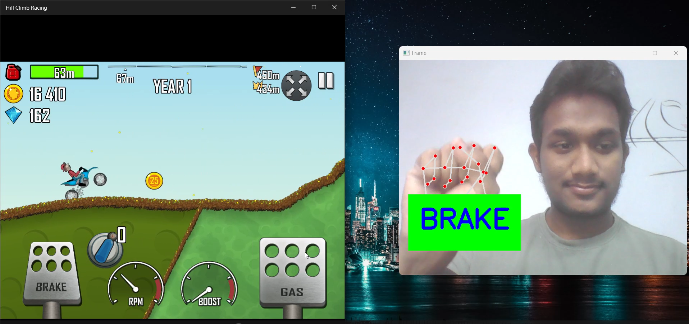

<h1>Controlling Hill Climb Racing with Hand Tacking</h1>

<h3>Opened Palm for Gas</h3>

 
<h3>Closed Palm for Brake</h3>

const colorizeColors = [
  Colors.purple,
  Colors.blue,
  Colors.yellow,
  Colors.red,
];

const colorizeTextStyle = TextStyle(
  fontSize: 50.0,
  fontFamily: 'Horizon',
);

return SizedBox(
  width: 250.0,
  child: AnimatedTextKit(
    animatedTexts: [
      ColorizeAnimatedText(
        'Larry Page',
        textStyle: colorizeTextStyle,
        colors: colorizeColors,
      ),
      ColorizeAnimatedText(
        'Bill Gates',
        textStyle: colorizeTextStyle,
        colors: colorizeColors,
      ),
      ColorizeAnimatedText(
        'Steve Jobs',
        textStyle: colorizeTextStyle,
        colors: colorizeColors,
      ),
    ],
    isRepeatingAnimation: true,
    onTap: () {
      print("Tap Event");
    },
  ),
);
